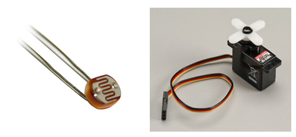
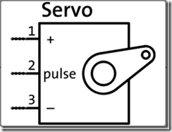
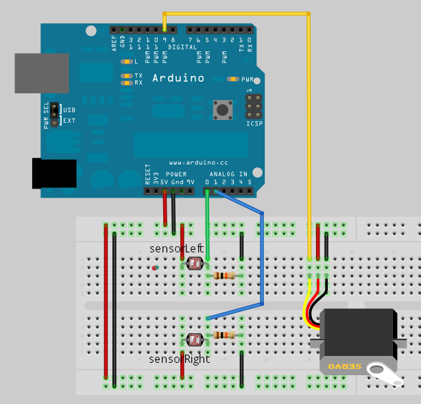
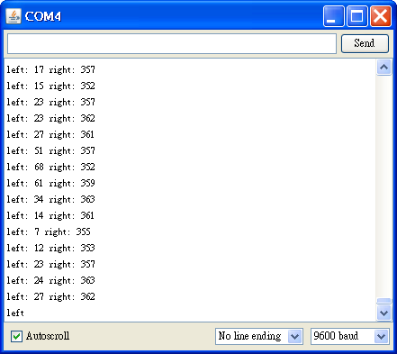

## Arduino入門教學(13) – 使用光敏電阻控制伺服馬達 (作者：Cooper Maa)

### 實驗目的

練習用光敏電阻控制伺服馬達(Servo motor)。以兩顆光敏電阻做一個簡單的光源追蹤系統，當發現左邊比較亮時，就控制伺服馬達旋轉到左邊，當發現右邊比較亮時，就控制伺服馬達旋轉到右邊。



### 讀者必備知識

為了順利進行本項實驗，你必須先知道底下這些基礎知識:

認識光敏電阻。相關資訊可參考「[Lab8 使用光敏電阻控制 LED 的開關](http://coopermaa2nd.blogspot.com/2010/12/arduino-lab8-led.html)」一文。
知道如何控制伺服馬達。相關資訊可參考「Lab16 使用可變電阻控制伺服馬達」一文。
材料

* 麵包板 x 1
* Arduino 主板 x 1
* 光敏電阻(photocell) x 2
* 伺服馬達(Servo Motor) x 1
* 10k ohm 電阻 x 2
* 單心線 x N
* 接線

伺服馬達有三條線，電源(紅線)、接地(黑線)，以及訊號線。



伺服馬達紅線接到 +5v，黑線接到 GND，訊號線接到 pin 9
左手邊的光敏電阻一支腳接到 5V，另一支腳串接一顆 10k 電阻接到 analog pin 0
右手邊的光敏電阻一支腳接到 5V，另一支腳串接一顆 10k 電阻接到 analog pin 1



下圖是本實驗的接法，為了判斷哪一邊光線比較強，所以稍微折彎了兩顆光敏電阻，讓它一顆往左彎，另一顆往右彎：


### 電路圖


### 程式碼

版本一(PhotocellServo.pde): 底下是這個簡單光源追蹤系統的程式碼，程式的邏輯是，當發現左邊比較亮時，就控制伺服馬達旋轉到左邊(旋轉到 0 度)，當發現右邊比較亮時，就控制伺服馬達旋轉到右邊(旋轉到 180 度)。程式同時把左右兩顆光敏電阻的讀值印到了 Serial port，到時就可以用 Serial Monitor 觀察光敏電阻數值的變化。

```CPP

// 使用光敏電阻控制 Servo

// 引用 Servo Library
#include <Servo.h> 

// 建立一個 Servo 物件 
Servo myservo; 
 
// 兩顆光敏電阻接在 Analog pin 0 及 pin 1
int sensorLeft = 0;
int sensorRight = 1;
 
void setup() 
{ 
  Serial.begin(9600);
  myservo.attach(9);  // Servo 接在 pin 9
} 
 
void loop() 
{
  int readingLeft, readingRight;
  
  // 讀取左右兩顆光敏電阻的讀值
  readingLeft = analogRead(sensorLeft);
  readingRight = analogRead(sensorRight);
  
  if (readingLeft > readingRight) {
    // 左邊光敏電阻較亮&#65292;控制 Servo 轉到 0 度
    myservo.write(0);                    // 設定 Servo 旋轉角度
    delay(15);                           // 等 Servo 旋轉
  } else {
    // 右邊光敏電阻較亮&#65292;控制 Servo 轉到 180 度
    myservo.write(180);                  // 設定 Servo 旋轉角度
    delay(15);                           // 等待 Servo 旋轉
  }

  // 印出左右兩顆光敏電阻的讀值
  Serial.print("left: "); Serial.print(readingLeft);
  Serial.print(" right: "); Serial.println(readingRight);  
} 
```

編譯這支程式，然後上傳到 Arduino，接著打開 Serial Monitor 就可以看到左右兩顆光敏電阻數值的變化：



底下是示範影片：

* <http://youtu.be/ryYl9DeqD5w>

版本二(PhotocellServoV2.pde): 這個版本增加一個功能，當左右兩邊光敏電阻光線相差不多時，就控制伺服馬達讓它旋轉到 90 度。

```CPP
// 使用光敏電阻控制 Servo, Version 2

// 引用 Servo Library
#include <Servo.h> 

// 建立一個 Servo 物件 
Servo myservo; 
 
// 兩顆光敏電阻接在 Analog pin 0 及 pin 1
int sensorLeft = 0;
int sensorRight = 1;
 
void setup() 
{ 
  Serial.begin(9600);
  myservo.attach(9);  // Servo 接在 pin 9
} 
 
void loop() 
{
  int readingLeft, readingRight, difference;
  
  // 讀取左右兩顆光敏電阻的讀值
  readingLeft = analogRead(sensorLeft);
  readingRight = analogRead(sensorRight);

  // 計算差值
  difference = abs(readingLeft - readingRight);

  // 假如左右兩邊光敏電阻差值不大&#65292;就控制 Servo 轉到 90 度
  if (difference <= 100) {
    myservo.write(90);
    delay(15);  
  } else if (readingLeft > readingRight) {
    // 左邊光敏電阻較亮&#65292;控制 Servo 轉到 0 度
    myservo.write(0);                    // 設定 Servo 旋轉角度
    delay(15);                           // 等 Servo 旋轉
  } else {
    // 右邊光敏電阻較亮&#65292;控制 Servo 轉到 180 度    
    myservo.write(180);                  // 設定 Servo 旋轉角度
    delay(15);                           // 等待 Servo 旋轉
  }

  // 印出左右兩顆光敏電阻的讀值
  Serial.print("left: "); Serial.print(readingLeft);
  Serial.print(" right: "); Serial.println(readingRight);  
} 
```

### 動動腦

光敏電阻加上伺服馬達，像這樣的組合可以應用在哪些地方呢?

### 延伸閱讀

* [Lab8 使用光敏電阻控制 LED 的開關](http://coopermaa2nd.blogspot.com/2010/12/arduino-lab8-led.html)
* [Lab16 使用可變電阻控制伺服馬達](http://coopermaa2nd.blogspot.com/2011/01/arduino-lab16.html)

【本文作者為馬萬圳，原文網址為： <http://coopermaa2nd.blogspot.tw/2011/01/arduino-lab17-servo.html> ，由陳鍾誠編輯後納入本雜誌】

