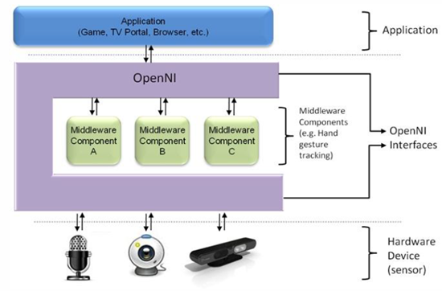
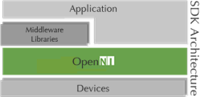

## OpenNI 簡介 (作者： [Heresy Ku](https://www.facebook.com/kheresy) )

微軟在 2010 年底，針對該公司的 Xbox 360 遊戲機，推出了以深度感應器為主體的體感攝影機、 [Kinect](http://kheresy.wordpress.com/2010/12/23/kinect/) ，算是以相當低廉的價格，把深度感應器、動作捕捉的系統，從本來屬於高價的實驗室產品、變成了遊戲機配件引進了家庭之中。

而由於其相對低廉的價格，算是一般人都買的起的設備，所以在推出之後沒多久，就馬上有不少人開始針對他進行研究，並成功地讓 PC 也可以透過 USB 來連接 Kinect、讀取他的資料。

之後，包括 OpenKinect（ [官網](http://openkinect.org/) ）在內，有不少開發方案陸續地出現，讓大家可以在 PC 上去存取 Kinect 的資料。而在這些方案中，第一個有官方性質的，應該就是這由 Kinect 核心晶片 PS1080 開發廠商、PrimeSense（ [官網](http://www.primesense.com/) ）所主導的 OpenNI 了！

### OpenNI 簡介

OpenNI 的官方網站是： <http://www.openni.org/> 。 

OpenNI 這個字是「Open Natural Interaction」的縮寫，大致上可以翻譯為「開放式自然操作」；而所謂的 NI 又包含哪些東西呢？OpenNI 對自然操作（Natural Interaction，以下簡稱 NI）的定義包含了「語音」、「手勢」、「身體動作」等等，基本上就是比較直覺、直接靠人本身來進行的操作方式了。

而 OpenNI 是在 2010 年 11 月建立、並在 12 月建立了網站、並放出他的第一版 SDK。在一開始，是一個針對 Kinect 這款感應器提供的跨平台、Open Source 開發環境；他除了提供了深度影像、彩色影像的讀取之外，PrimeSense 也自己放出了名為 NiTE 的 middleware（這個不是 OpenSource）、來提供人體骨架追蹤等功能，這也讓 OpenNI 成為當時要進行相關程式開發最簡單、完整的一個環境～（註 1）

而目前 OpenNI 提供了 Windows、Linux、Mac OS X 上的開發環境，除了 x86 和 x64 外，也有支援 ARM（Linux）架構的處理器，對於要在非 Windows 平台上，進行體感程式、深度感應器程式開發的人來，應該算是一個相對完整的環境了～

雖然由於 OpenNI 主要是由 PrimeSense 在進行維護，所以支援的硬體也是以 PrimeSense 自家的產品為主（Microsoft Kinect、ASUS Xtion…），不過由於其 Open Source 的性質，實際上他也是可以靠自行擴充模組，來支援其他感應器的。

### OpenNI 版本

目前 OpenNI 已經有兩個大版本了，一個是一開始的 1.x 版（最終為 1.5），另一個則是 2012 年底推出的 2.x 版（目前為 2.2）；目前 OpenNI 已經沒有在維護 1.x 版，更新都是針對 2.x 發布而已。而這兩者在功能、與介面上，都有相當大的差異，彼此之間也完全不相容，這是在使用時要注意的。

#### OpenNI 1

OpenNI 1.x 基本上是提供了一個大的框架，在裡面定義了所有功能的使用介面；他所提供的主要功能包括了：

* 讀取深度、彩色、紅外線影像的資料
* 讀取聲音資料
* 手勢偵測、手部位置追蹤
* 姿勢偵測、人體追蹤、人體骨架（關節點）追蹤

不過基本上，OpenNI 只有提供讀取影像的功能，進一步的骨架追蹤等功能，都是要靠所謂的「middleware」、以 plug-in 的形式來提供實作。而為了讓大家可以順利地進行開發，雖然並非開放原始碼的，PrimeSense 還是提供了一套可以免費使用的 NiTE 作為 OpenNI 的 middleware，讓 OpenNI 有完整的功能。

右上圖，就是 OpenNI 1 的架構圖。這樣設計的好處，就是開發者只需要學習 OpenNI 怎麼用、而不需要去知道 middleware 怎麼實作的，就可以完成程式的開發了～因為這些聯繫的部分，會由 OpenNI 做掉。

不過相對的，這樣做的缺點，就是  OpenNI 本身定義的框架，也限制了 Middleware 能做的事。為了要遵守 OpenNI 所定義的介面，所以 middleware 的開發者，也僅能按照 OpenNI 的定義、來提供已經定義好的功能，而沒辦法擴增新的功能；某種程度上，這應該也是 OpenNI 1 一直到最後，都還是只有 PrimeSense NiTE 這個 middleware 的原因。

而如果想要知道 OpenNI 1 的程式怎麼寫的話，可以參考 [《OpenNI 1.x 教學文章》](http://kheresy.wordpress.com/index_of_openni_and_kinect/documents-of-openni-1-x/) 、或是之前整理的 [課程投影片與範例程式](http://kheresy.wordpress.com/2012/04/01/resource-of-openni-course-with-msa/) ；雖然 OpenNI 1 的部分 Heresy 應該已經不會再去更新了，不過應該也已經涵蓋了絕大部分 OpenNI 1 的功能了。

目前 OpenNI 的官方網站，還有提供 OpenNI 1 最終版本的下載，其下載連結為：

* <http://www.openni.org/openni-sdk/openni-sdk-history-2/>

所需要的檔案包括了：OpenNI SDK v1.5.4.0、OpenNI-Compliant Sensor Driver v5.1.2.1、NiTE v1.5.2.21，安裝的教學則可以參考 [《2012 OpenNI 環境／Kinect 安裝教學》](http://kheresy.wordpress.com/2012/03/15/2012_openni_env_kinect_setup/) 。

### OpenNI 2

相較於 OpenNI 1，OpenNI 2 整個介面簡化許多。OpenNI 2 基本上是變成只去定義深度感應器原始資料的讀取，而不去做額外的分析；像是骨架分析、手勢偵測這類靠分析出來的結果，OpenNI 2 基本上是完全不去理會了～

而如果要做這些進一步的分析的話，OpenNI 2 是把這類基於 OpenNI 2 取得的原始資料拿來分析的函式庫，通稱為「middleware library」；但是實際上，在 OpenNI 2 的架構裡面，並沒有針對這些「middleware library」做任何的定義、限制，所以這些額外的函式庫可以提供更多的功能。

在這樣的設計下，OpenNI 本身變得相當地輕巧，使用上也更為單純；而且同時，middleware library 的開發也變得相當地自由，可以提供各式各樣的功能。目前，OpenNI 的官方網站（ [連結](http://www.openni.org/software/?cat_slug=file-cat1) ）上，包含 PrimeSense 的 NiTE 2 在內，也已經有 16 個 middleware library 可以下載了～

不過，這樣做的缺點，基本上就是要使用不同的 middleware library 的時候，就必須要各自去學習不同的 library 的介面、使用方法，對於不同的設計風格，如果又缺少文件的話，其實是相對不容易上手的。
而如果想要學習 OpenNI 2 的程式開發的話，則可以參考 [《OpenNI 2.x 教學文章》](http://kheresy.wordpress.com/index_of_openni_and_kinect/documents-of-openni-2-x/) 這邊整理的教學文章，或是 [《OpenNI 2 & NiTE 2 課程投影片與範例》](http://kheresy.wordpress.com/2013/03/22/course-data-of-openni2-and-nite-2/) ；針對 OpenNI 2 和 PrimeSense NiTE 2 的教學文章，基本上也都整理告一個段落了，之後還有想到要寫些什麼，應該也會慢慢地補充。

OpenNI 2 本身可以直接在官方的下載頁面下載，其連結是：

* <http://www.openni.org/openni-sdk/>

目前最新的版本是 OpenNi 2.2.0.30 Beta，基本上只需要一個檔案，不像 OpenNI 1 那麼複雜。而所需要的 Middleware Library，則可以在註冊 OpenNI 網站會員後，在 [OpenNI 的下載頁面](http://www.openni.org/software/?cat_slug=file-cat1) 下載。

### 區分 OpenNI 1 和 OpenNI 2 的程式碼

而如果看到一段 OpenNI C++ 程式碼，想要區分他是 OpenNI 1 還是 OpenNI 2 的話，最簡單的方法，就是去看他 include 的 header 檔、以及函式與類別的 namespace。

OpenNI 1 所需要 include 的 header 檔，是 XnCppWrapper.h，而相關的函示和類別，基本上都是在 xn 這個 namespace 下面。
OpenNI 2 的話，則是要 include OpenNI.h 這個 header 檔，所有相關的物件，則都是在 openni 這個 namespace 下面。

所以，只要看到程式裡面是使用 xn::— 的話，基本上就是 OpenNI 1 的程式；而如果看到 openni::— 的話，基本上就是 OpenNI 2 了～
而也由於不管是檔案、還是程式的介面，都是完全不同的，所以 OpenNI 1 和 OPenNI 2 基本上是完全不相容的。不過，也由於這樣，OpenNI 1 和 OpenNI 2 的 SDK 是可以同時安裝的！只要設定好，是可以在同一台電腦上，各自進行 OpenNI 1 和 OpenNI 2 的程式開發的。

不過，如果是使用微軟的 Kinect 感應器、而需要同時開發 OpenNI 1 和 OpenNI 2 的程式的話，會因為驅動程式的關係，而有一些問題就是了。

### 對 Microsoft Kinect 感應器的支援

雖然在 OpenNI 一開始推出的時候，市面上買的到的感應器只有 Microsoft 的 Kinect for Xbox 360，不過由於 Kinect 始終是微軟的產品，並非由微軟直接支援 OpenNI，所以其實 OpenNI 對於 Kinect 系列的感應器，在支援上是有小繞一下的。

在 OpenNI 1 的時候，由於當時微軟尚未推出 Kinect for Windows SDK，所以就算是在 Windows 上，也沒有官方的 Kinect 驅動程式可以用。而當時 OpenNI 1 的 Sensor 驅動程式模組，主要是針對 PrimeSense 自家的感應器做支援，並沒有直接支援 Kinect 感應器；如果要在 OpenNI 1 的環境中使用 Kinect 膽應器的話，實際上是需要另外去安裝基於 OpenNI 的官方版本修改的 第三方 SensorKinect（[GitHub](https://github.com/avin2/SensorKinect) ） 模組的。（註 2）

而到了 OpenNI 2 的時候，微軟的 Kinect for Windows SDK 也已經發展了一段時間了；應該是為了遵守微軟的授權規定，所以變成是以透過 Kinect for Windows SDK 來使用 Kinect 這樣的形式，讓 OpenNI 2 可以存取 Kinect 的資料。這樣做的好處是 Kinect 可以使用微軟官方版的驅動程式，所以也可以直接使用微軟的 Kinect for Windows SDK；但是缺點就是只剩下 Windows Vista 以後的電腦，可以在 OpenNI 2 環境中使用 Kinect 了。（註 3）

另外，由於在 OpenNI 2 和 OpenNI 1 下要使用 Kinect 感應器，是需要不同的驅動程式的，所以如果是需要在同一台電腦上，分別去開發 OpenNI 1 和 OpenNI 2 的話，是會需要強制更換 Kinect 所使用的驅動程式的（參考）；這點在使用上，可能會造成一些困擾。

### 附註：

雖然微軟後來也有推出 Kinect for Windows SDK，讓開發人員可以在 Windows 上使用 Kinect 感應器做開發（ [參考](http://kheresy.wordpress.com/2011/06/17/microsoft_kinect_sdk_beta/) ）、後來甚至也針對 Windows PC，推出了略為修改的 [Kinect for Windows 感應器](http://kheresy.wordpress.com/2012/02/02/kinect_for_windows_release/) ，但是在起步的時間點，算是比 OpenNI 晚上不少的。

OpenNI 1 剛推出的時候，市面上應該是還沒有 PrimeSense 公版的感應器。而 PrimeSense 之所以沒有直接在 OpenNI 公版的裝置驅動模組裡面加上對 Kinect 的支援，Heresy 個人認為應該是在迴避微軟對於 Kinect 可能的授權問題，所以才變成是要靠第三方修改版來做支援。

針對 Linux 和 Mac OS X 的平台，目前也有人透過 libfreenect，來針對 OpenNI 2 寫出支援 Kinect 的驅動程式模組；有需要的話可以參考： <https://github.com/piedar/OpenNI2-FreenectDriver> 。

PrimeSense 所提供的 NiTE 這套 Middleware，主要是提供了基於深度影像，進行人體骨架追蹤、姿勢偵測，手勢偵測、手部追蹤等功能的函式庫；他不像 OpenNI 是 Open Source 的，PrimeSense 僅有放出編譯好的 binary 檔案。不過他基本上可以免費使用，但是限制是只能用在使用他自家晶片的產品上。

【本文來自 Heresy's Space 的網誌，原文網址為： <http://kheresy.wordpress.com/2013/09/30/about-openni-2013/> ，由 Heresy 捐出網誌給程式人雜誌，經陳鍾誠編輯後納入雜誌】

